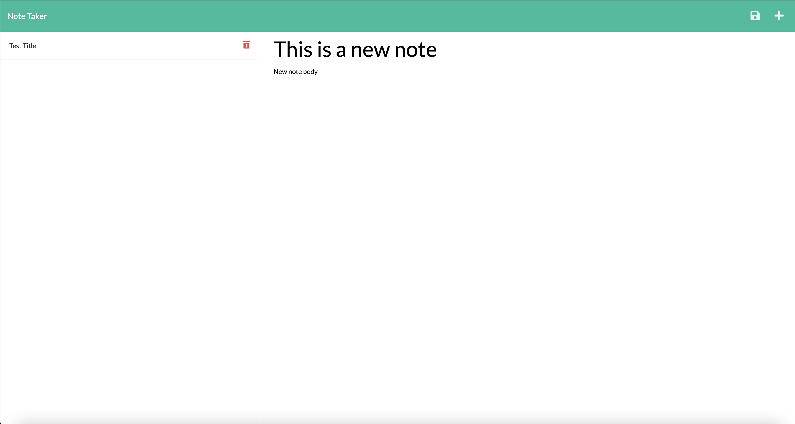

# Note Taker

## Description

The Note Taker aplication does just that, it takes notes. It is supposed to mimic a full stack 
application. It has different "routes" for taking and displaying notes. The application
uses a json file to mimic basic interaction with a database.

## Table of Contents 

- [Installation](#Installation)
- [Usage](#Usage)
- [Credits](#Credits)
- [License](#License)

## Installation

(For Development)
Installation instructions: `npm i`    

## Usage
If developing, after the installation instructions have been completed you can start the application by running `npm start`. 
Otherwise you can visit to use the deployed version,  . To take a note click get started. You will then been taken to the page where
you can take notes. After you fill out the title and have written something in the body, the save button will appear. Click the save
button to save the note you made. You will then see your note appear to the left. Click on the saved note to display it the or click the
red trash can if you want to delete it. If a saved note is being displayed you can click the plus button to start a new note.

Screenshot of the deployed application:

## Credits

N/A 

## License

N/A

